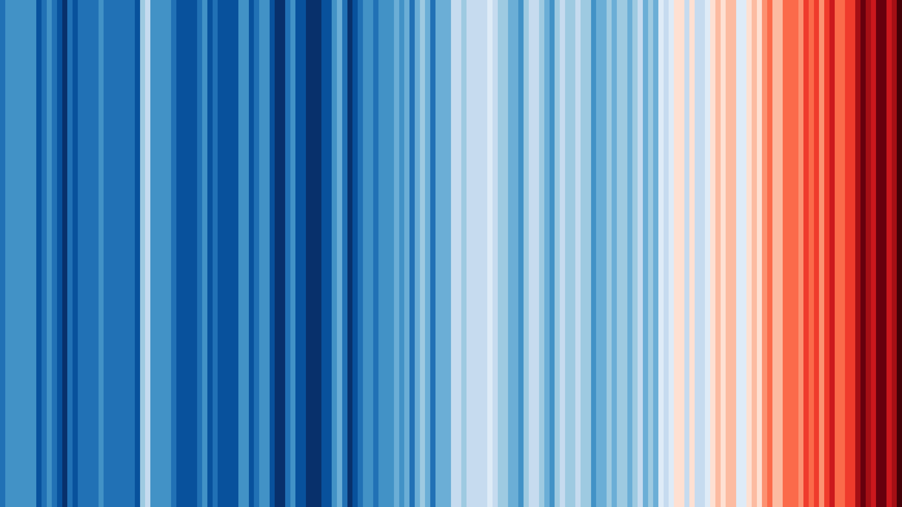

# PROJECT: qlstm-with-qiskit-and-pytorch

We - Jonas Michel, Felix Lehner & Stefan Kister - build a quantum quantum Long Short-Term Memory (qLSTM) demonstrator with the quantum development framework Qiskit V1.x [1]. 

LSTM [2]can be used in different use cases, e.g. language modeling, machine translation (sequence to sequence learning), image captioning, handwriting generation, image generation using attention models.  In our demonstrator qLSTM we use LSTM for predicting time series data.

We are utilizing the integrated PyTorch workflow in Qiskit to build a hybrid quantum-classical qLSTM program. We use variational quantum circuits (VQA) for representing the weights in the classical LSTM cell [3]. The variational quantum circuits are built of 2 parts: An encoding layer (quantum feature map) to load classical data points into quantum feature space, and a variational layer (ansatz) which contains the tunable parameters.

The demonstrator will use the Aer statevector simulator for noise free QC simulations. We will also provide fake backends which can be used with different noise-models to simulate qLSTM in a more realistic environment and to learn to deal the noise in quantum devices. We plan to provide also different data sources which can be used for demonstration purposes.

## TITLE: Predicting future Warming Stripes with a Quantum Long Term Short Memory (qLSTM) Model

## AUTHORS:

Felix Lehner ...,  
Jonas Michel... ,  
Dr. Stefan Kister ... 

## ABSTRACT:

For this qLSTM demonstrator we use public data from a MetOffice database [4] which is used to create the warming stripes [5] provided by Ed Hawkins from University of Reading [6]. 

The data shows the global temperature for every year since 1850, so that data source is small which we assume might be an advantage for a quantum approach. It is scaled relatively to the average of the temperature of 1971-2018 to get a data range between -1 and 1 which is then represented in a color scheme in the stripes diagram.

<break>
    GLOBAL WARMING STRIPES 2023
<BREAK>
    
</BREAK>

We use for prediction of this time series OF TEMPERATURE DATA aN LSTM model with a classical PyTorch workflow. The quantum part is used to represent the weights in the LTSM cell which is integrated via a Torch connector of Qiskit into PyTorch.

Demonstrator Notebook: 

References:  
[1] Qiskit: https://github.com/Qiskit/qiskit  
[2] Hochreiter, Sepp, and Jürgen Schmidhuber. “Long Short-Term Memory.” Neural Computation 9, no. 8 (November 1, 1997): 1735–80. https://doi.org/10.1162/neco.1997.9.8.1735.  
[3] Chen, Samuel Yen-Chi, Shinjae Yoo, and Yao-Lung L. Fang. “Quantum Long Short-Term Memory.” In ICASSP 2022 - 2022 IEEE International Conference on Acoustics, Speech and Signal Processing (ICASSP), 8622–26. Singapore, Singapore: IEEE, 2022. https://doi.org/10.1109/ICASSP43922.2022.9747369. 

[5] #ShowYourStripes Website: https://showyourstripes.info/
[6] Link to PROFESSOR ED HAWKINS: https://research.reading.ac.uk/meteorology/people/ed-hawkins/

Other Climate Data Sources:
[x1] Link to NASA data base: https://data.giss.nasa.gov/gistemp/graphs_v4/) 
[x2] Lenssen, Nathan J. L., Gavin A. Schmidt, James E. Hansen, Matthew J. Menne, Avraham Persin, Reto Ruedy, and Daniel Zyss. “Improvements in the GISTEMP Uncertainty Model.” Journal of Geophysical Research: Atmospheres 124, no. 12 (June 27, 2019): 6307–26. https://doi.org/10.1029/2018JD029522.

